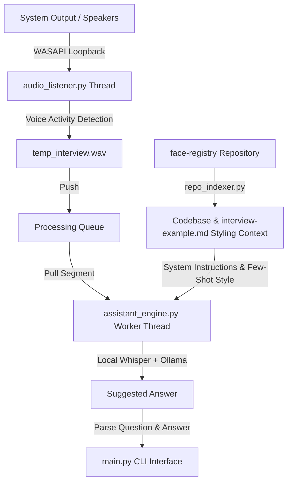

# 🎙️ Jarvis Interview

`jarvis-interview` is a terminal-based AI assistant designed to listen to system audio during technical interviews, transcribe questions, and suggest technical answers using a specific GitHub repository (`face-registry`) as its context.

It runs **100% locally and offline** on your computer. It features a **fully asynchronous, non-blocking continuous capture pipeline** that isolates system audio (the interviewer speaking over Google Meet, Zoom, MS Teams, etc.) and ignores your microphone, rendering real-time answers tailored to your personal speaking and coding style.

---

## 🚀 Key Features

- **🖥️ Asynchronous Loopback Audio Capture (Windows WASAPI)**: Runs a background recording thread that never pauses, capturing all system audio even while the AI model is busy transcribing or generating answers.
- **📥 Thread-Safe Processing Queue**: Speech segments are pushed to a queue. A worker thread handles Speech-to-Text and generation in sequence, ensuring no questions are dropped or missed.
- **📚 Codebase In-Context RAG**: Clones and indexes the [face-registry](https://github.com/batistell/face-registry) repository. It compiles all docs and backend Java files into the system prompt of the model.
- **🗣️ Customized Tone & Style**: Learns your personal voice style directly from the `interview-example.md` file (which contains architectural details and interview prep questions/answers written by you) and mirrors it in its suggested answers.
- **🤖 100% Local Inference**:
  - **Local STT**: Powered by **`faster-whisper`** (running the fast `base` model in Portuguese). Bypasses the need for system-level FFmpeg using Python's `PyAV` internally.
  - **Local LLM**: Powered by **Ollama** running **`qwen2.5:3b`** (optimized for speed/CPU) or **`qwen2.5:7b`** / **`llama3.1:8b`** (for detailed reasoning).
- **🔁 Interactive Terminal Interface**:
  - Displays real-time status (`[LISTENING]`, `[RECORDING]`, `[THINKING]`).
  - Prints the interviewer's question transcript.
  - Generates technical, concise answers.
  - Allows response **regeneration** at any time.
  - Provides hotkeys (`r` to regenerate, `c` to clear conversation history, `Enter` to force-stop recording and process immediately, `q` to quit).

---

## 🛠️ Architecture



1. **Audio Listener (`audio_listener.py`)**: Uses `PyAudioWPatch` to access the WASAPI loopback device in a dedicated thread. It records audio frames, calculates RMS to detect voice presence, and writes segments to `temp_interview.wav`, pushing them onto a queue when speech turns finish. It immediately resumes listening.
2. **Repository Indexer (`repo_indexer.py`)**: Clones `face-registry` locally, traverses the backend source code (`.java`) and docs (`.md`), and extracts styling rules from `interview-example.md` to customize the voice of the assistant.
3. **Assistant Engine (`assistant_engine.py`)**: A worker thread that pulls segments from the queue, performs local transcription via `faster-whisper`, and generates answers via the local `ollama` client.
4. **CLI Controller (`main.py`)**: Controls the console view, uses a non-blocking Windows keyboard input monitor (`msvcrt`), and drives the conversation loop.

---

## 📋 Prerequisites

- **OS**: Windows (needed for WASAPI loopback with `PyAudioWPatch`).
- **Python**: version 3.10 or higher.
- **Git**: Installed and available in your environment path.
- **Ollama**: Installed and running on your system (download from [ollama.com](https://ollama.com)).

---

## ⚙️ Installation & Setup

1. **Clone this workspace** (if not already local).
2. **Initialize the Virtual Environment**:
   ```powershell
   python -m venv .venv
   .venv\Scripts\activate
   ```
3. **Install Dependencies**:
   ```powershell
   pip install PyAudioWPatch faster-whisper ollama GitPython PyYAML numpy
   ```
4. **Prepare the Local LLM**:
   Make sure Ollama is running, then pull the recommended Portuguese-optimized coding model:
   ```powershell
   ollama pull qwen2.5:3b
   ```
   *(Alternatively, you can pull `qwen2.5:7b` or `llama3.1:8b` if your computer has a dedicated GPU).*

---

## 🎮 How to Run

Start the assistant from the terminal:
```powershell
python main.py
```

### Keyboard Controls

While running:
- **`Enter`**: If the interviewer is speaking and you want to trigger the response generation immediately without waiting for silence detection.
- **`r` / `R`**: Regenerate the last suggested answer (will request the local model to generate another variation).
- **`c` / `C`**: Clear conversation history.
- **`q` / `Q`**: Quit the application safely.

---

## 📝 Configuration (Settings)

You can customize thresholds in `config.yaml` or directly inside `main.py`:
- `SILENCE_THRESHOLD`: Peak amplitude/RMS below which audio is considered silence.
- `SILENCE_SECONDS`: Duration in seconds of continuous silence required to trigger processing.
- `OLLAMA_MODEL`: Default is `qwen2.5:3b`.
- `WHISPER_MODEL`: Default is `base` (downloads and runs locally).
- `WHISPER_DEVICE`: Default is `cpu` (use `cuda` if you have an NVIDIA GPU).